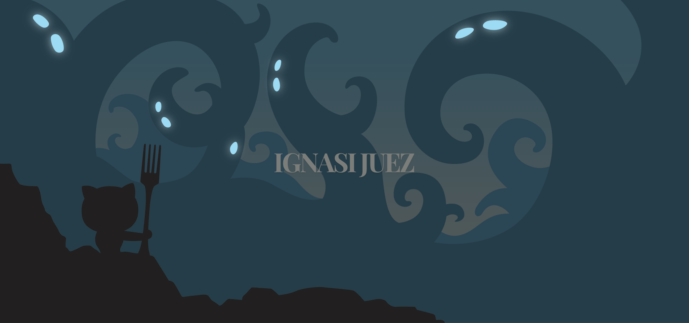

  

###

<h3 align="left"> About Me</h3>

###

 Hi, I’m Ignasi – a Software Engineer from Spain specialized in IT with extensive knowledge of security best practices and compliance. I have over 4 years of IT education, including programming, networking, systems, security, and cloud. Currently, I’m working on my Bachelor's final project, focusing on cloud infrastructure and DevOps.

###

<h3 align="left">🛠 Language and tools</h3>

###

  
  
  
  
  

  
  

  
  

  
   

  
  

  
  

  
  

  
  

  
  

  
  
          
  
  
  
  
  

###
